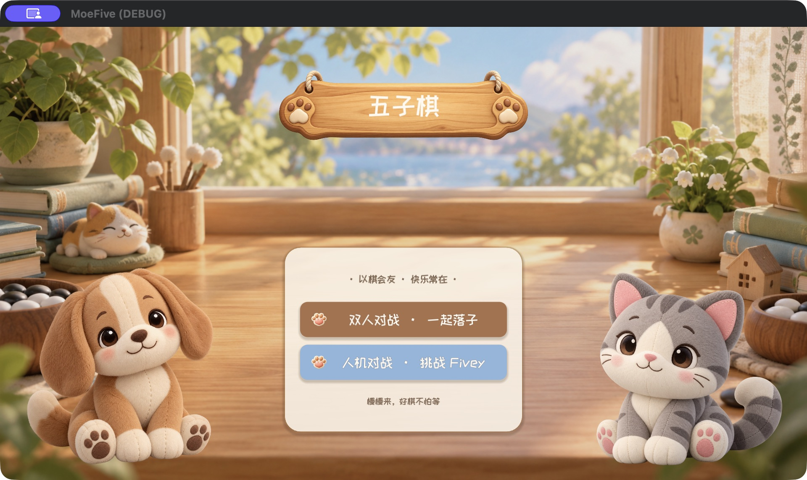
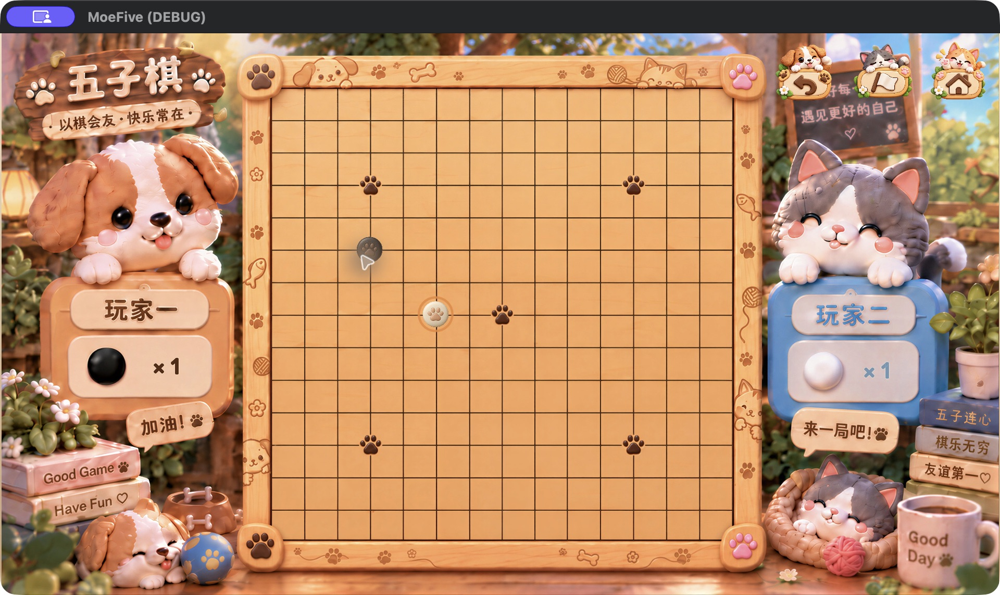

# MoeFive · 萌五子棋

**在暖暖的窗边，和朋友或 Fivey 下一局五子棋。**

MoeFive 是一款中文萌宠风格的休闲五子棋游戏，也是 Moe 棋类系列的一员。木质棋盘、爪印棋子和猫狗伙伴，把熟悉的五子连珠变成轻松的小对局。

[下载测试版本](https://github.com/ShenZiLi/MoeFive/releases) · [玩法与功能](#玩法与功能) · [从源码运行](#从源码运行)



## 玩法与功能

| 功能 | 体验 |
| --- | --- |
| 双人对战 | 两位玩家在同一设备上轮流落子，一起切磋棋艺。 |
| 人机对战 | 玩家执黑先行，电脑执白应手；首页直接进入高手难度对局。 |
| 休闲规则 | 15 × 15 棋盘，无禁手；横向、纵向或斜向连成五子即可获胜。 |
| 悔棋 | 双人模式撤回一步，人机模式撤回到玩家落子前；对局中可多次使用。 |
| 对局反馈 | 显示双方棋子数量、最近落子标记与电脑思考状态，结束后显示结算。 |
| 便捷操作 | 支持认输、返回主页和键盘快捷键。 |

选择首页的「双人对战」或「人机对战」，点击棋盘空交叉点落子。黑白双方交替行动，先连成五子的一方获胜；棋盘下满且无人获胜则为平局。返回主页会结束当前对局，进度不会保存。



对局右上角依次提供悔棋、认输和返回主页。认输与返回主页会弹出确认提示。

| 按键 | 操作 |
| --- | --- |
| `U` | 悔棋 |
| `R` | 认输 |
| `Esc` | 关闭对局弹窗 |
| `F11` | 在对局中切换全屏 |

> 上图为当前桌面版本的实际运行截图。项目仍在开发中，后续版本可能调整界面与体验。

## 下载与平台

到 [GitHub Releases](https://github.com/ShenZiLi/MoeFive/releases) 查看可用测试版本及对应版本说明。

仓库已配置四类发布产物：

| 平台 | 发布产物 |
| --- | --- |
| Windows | 独立的 x86_64 可执行文件 |
| Android | 用于测试的 debug 签名 APK |
| macOS | Universal 应用 ZIP，尚未签名或公证 |
| iOS | 未签名的 Xcode 项目 ZIP，需要在 Xcode 中配置签名后构建；不是可直接安装的 IPA |

Linux 和 Web 属于目标平台，目前不在自动发布流程中。移动端采用横屏，桌面窗口以 1920 × 1080 为基准。

## 从源码运行

项目使用 **Godot 4.7.2、GDScript 和 Compatibility 渲染器**。中文字体随项目内置，无需另装系统字库。

```bash
git clone https://github.com/ShenZiLi/MoeFive.git
cd MoeFive
```

在 Godot 项目管理器中导入 `project.godot`，等待资源导入完成，再按 **F5** 运行项目。

也可以使用命令行。以下假设 Godot 可执行文件已配置到 PATH：

```bash
# 首次运行或切换分支后，先更新资源与脚本类型缓存
godot --headless --editor --path . --import --quit

# 启动游戏
godot --path .
```

macOS 默认安装位置可使用：

```bash
/Applications/Godot.app/Contents/MacOS/Godot --path .
```

## 开发与验证

```text
project.godot       项目配置与平台设置
main.tscn           入口场景
scripts/            棋盘规则、AI、主流程与棋盘绘制
scenes/match/       对局界面及组件
assets/             角色、棋盘、界面图片与内置字体
tests/              核心规则和场景流程测试
docs/               需求、技术选型、美术清单与截图
```

完成资源导入后，可运行已有检查：

```bash
godot --headless --path . --script res://tests/test_core.gd
godot --headless --path . --script res://tests/test_smoke.gd
godot --headless --path . --script res://tests/test_pve_entry.gd
godot --headless --path . --script res://tests/test_match_flow.gd
godot --headless --path . --script res://tests/test_landscape_orientation.gd
```

当前已实现核心对局、萌宠视觉界面、内置字体与多平台发布流程。动效、音效及更多平台适配仍将继续完善。

## 项目资料与字体授权

- [需求文档](docs/需求文档.md)
- [技术选型评估](docs/技术选型评估.md)
- [美术资源清单](docs/美术资源清单.md)
- 内置字体 ZCOOL KuaiLe 与 Fredoka 的授权分别见 [ZCOOL 字体许可证](assets/fonts/OFL-ZCOOLKuaiLe.txt) 和 [Fredoka 字体许可证](assets/fonts/Fredoka-OFL.txt)。字体授权仅适用于对应字体文件。

**以棋会友 · 快乐常在。**
